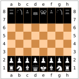
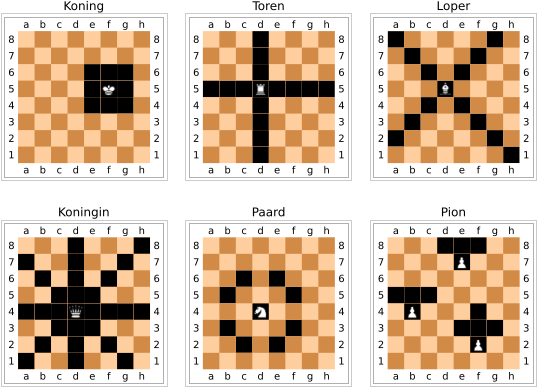

# Opgave Project Logisch programmeren

De opgave van dit jaar bestaat uit het implementeren van een schaakcomputer. In dit document geven we een overzicht van de basis functionaliteit van deze schaakcomputer. Verder geven we de vereisten waaraan je project moet voldoen.

## Basis API van de schaakcomputer

Je schaakcomputer moet een programma zijn dat een schaakspel kan inlezen uit een `.pgn` bestand (PGN notatie wordt verder toegelicht), waarbij de bestandsnaam als commandolijn argument wordt meegegeven, en dan de beste zet volgens je schaakcomputer naar de standaard output schrijft in PGN notatie.
Je mag je dus beperken tot het implementeren van de schaakcomputer als een input-output programma, je hoeft zelf geen GUI te schrijven.

Je programma wordt als volgt opgeroepen:

```bash
> swipl -t halt -f -q -O ./main.pl -- {bestandsnaam}
```

Het PGN formaat bestaat uit een reeks optionele tags die de metadata van het spel voorstellen, gevolgd door de zetten van het spel in de korte algebraïsche notatie (SAN).
Hieronder een voorbeeld van een heel kort spel:

```bash
> cat fool.pgn
[White "Schlatt"]
[Black "Botez, Alexandra"]
[Rules "classic"]
[Result "*"]

1. g4 e5 2. f3 *
```

De "\*" duidt aan dat dit spel nog niet beslist is.
De zwartspeler kan hier echter wit schaakmat zetten met 1 zet.
Als we dit bestand dus aan je schaakcomputer geven is de verwachte output alsvolgt:

```bash
> swipl -t halt -f -q -O ./main.pl -- fool.pgn
1. g4 e5 2. f3 Qh4# 0-1
```

Zoals je hier ziet wint zwart met de zet **Qh4#**.
In de output worden de tags ook weggelaten, maar wordt het winnende resultaat wel juist weergegeven.
Meer uitleg over SAN en PGN vind je onderaan de opgave.

## Testen van de schaakcomputer

Een basistest voor het uittesten van je schaakcomputer is om hem te laten spelen tegen een random speler. We voorzien code om je schaakcomputer een spel te laten spelen tegen een random speler. Die testcode gaat tijdens het spelen ook na of je schaakcomputer steeds legale zetten maakt. Indien je schaakcomputer een niet legale zet maakt zal je hiervan op de hoogte gesteld worden.

Daarnaast moet je schaakcomputer een optioneel argument “TEST” aanvaarden om alle volgende mogelijk stappen naar de standaard uitvoer te schrijven. Deze functionaliteit zal gebruikt worden om je project automatisch te evalueren. We verwachten dat je ook zelf testcode maakt om je schaakcomputer te testen (je mag hiervoor vertrekken van de voorziene code). Je schaakcomputer hoeft geen ondersteuning te hebben voor de "driemaal dezelfde stelling” regel.

1. Alle mogelijke stappen worden teruggegeven in het PGN formaat, waarbij alle tags weggelaten worden.
2. Elke mogelijke stap staat op een nieuwe lijn.

Hieronder vind je een voorbeeld van de output voor het "TEST" argument, waarbij de zetten d3, d5, en Nf3 reeds genomen werden in het spel.
Enkel de eerste vier lijnen worden getoond.

```bash
> swipl -t halt -f -q -O ./main.pl -- examples/london.pgn TEST
1. d4 d5 2. Nf3 Nd7
1. d4 d5 2. Nf3 Nc6
1. d4 d5 2. Nf3 Na6
1. d4 d5 2. Nf3 Bd7
...
```

Je kan de output van je programma ook steeds visualiseren op [chess.com](https://www.chess.com/analysis?tab=analysis).
Daarnaast is de [chess.js](https://github.com/jhlywa/chess.js/blob/master/README.md) library ook een handige tool om alle mogelijke stappen van een spel te vinden.
Deze library wordt ook gebruikt in de voorziene testcode.

## King of the Hill

Naast een klassiek schaakspel, moet je schaakcomputer ook de "King of the Hill" variant ondersteunen.
In deze schaakvariant, kan je naast de normale schaakmat ook winnen door je koning op een van de centrale velden te plaatsen.
De velden e4, d4, e5, and d5 zijn dus de "top van de heuvel".
Alle andere schaakregels zijn nog steeds van tel.

De schaakvariant wordt in de PGN notatie aangeduid met de `Rules` tag:

```pgn
[Rules "koth"]
```

Meer uitleg over de PGN notatie vind je in de sectie *Portable Game Notation (PGN)*.

## Niet functionele eisen

Naast de basisfunctionaliteit vragen we enkele niet functionele eisen waar je project aan
dient te voldoen. Deze niet functionele eisen zijn even belangrijk als de functionele eisen
van het project.

- De code moet goed gedocumenteerd zijn, er moet commentaar geschreven zijn bij praktisch elk predicaat. Indien je de gestructureerde comments wilt volgen zoals die in de officiële documentatie gebruikt wordt, verwijzen we u naar [deze pagina](https://www.swi-prolog.org/pldoc/man?section=pldoc-comments).
- Je code moet getest zijn, dit wil zeggen dat je voor elk van de bewegingen zelf een test schrijft zodat je zeker bent dat de basis functionaliteit werkt. Gebruik hiervoor bijvoorbeeld [PLUnit](https://www.swi-prolog.org/pldoc/man?section=unitbox).
- Je schaakcomputer moet gebaseerd zijn op een variant van min-max bomen (alpha-bèta snoeien). We laten uitzonderingen toe op deze regel in onderling overleg met de assistent van het vak.
- Je schaakcomputer moet testbaar zijn met de voorziene code in de opgave repository.

## Verslag

We verwachten een *bondig* verslag die de algemene oplossingsstrategie van je schaakcomputer beschrijft. Voeg aan je verslag je code toe met lijnnummers zodat je in de uitleg van je verslag kan verwijzen naar de relevante delen van je code. Je bent zelf vrij hoe je dit verslag organiseert maar we verwachten op zijn minst de volgende onderdelen:

- Inleiding
- Bord voorstelling
- Algoritme (met kort voorbeeld)
- Conclusie (wat heb je gerealiseerd en wat kan beter)

## Checklist

Je project is veel meer dan enkel de code van de schaakcomputer, hieronder een checklist
om na te gaan of je alle onderdelen hebt afgewerkt.

- [ ] Schaakcomputer
- [ ] King of the Hill regels
- [ ] Code documentatie
- [ ] Testcode
- [ ] Test functionaliteit
- [ ] Verslag
- [ ] GitHub username opgeven op Ufora

## Basis regels

De regels van schaken hebben we voor jullie hieronder nog eens overgenomen van wikipedia.

https://nl.wikipedia.org/w/index.php?title=Schaken&oldid=51233822#Spelregels

Schaken heeft een aantal basis regels die jou schaakcomputer moet respecteren. Op elk veld van het schaakbord mag hoogstens 1 stuk staan. Door een eigen stuk te spelen naar een veld waarop een stuk van de tegenstander staat, wordt dat stuk geslagen en van het bord genomen, het slaande stuk komt in de plaats. Met uitzondering van het paard bewegen alle stukken volgens een rechte lijn waarbij er geen stukken op niet-eindpunten van de beweging zijn. Met andere woorden, enkel het paard kan over andere stukken "springen".

- Een koning neemt één stap tegelijk, recht of diagonaal. Daarnaast heeft de koning eenmaal per partij een speciale mogelijkheid, zie korte en lange rokade.
- Een dame mag naar keuze horizontaal, verticaal of diagonaal bewegen.
- Een toren mag naar keuze horizontaal of verticaal bewegen (als de loop niet door andere stukken geblokkeerd wordt).
- Een loper mag diagonaal bewegen.
- Een paard beweegt door eerst 2 velden horizontaal of verticaal en daarna 1 veld in een richting loodrecht daarop; Een paard kan in tegenstelling over de andere stukken ‘springen’.
- Een pion kan uitsluitend recht vooruit gaan als het veld recht vooruit leeg is, en hij kan uitsluitend schuin vooruit gaan als hij daarmee een stuk slaat. Vanuit zijn begin positie (rij 2 of 7) heeft een pion ook de mogelijkheid om twee vakken vooruit te gaan.

Het doel van het spel is het schaakmat zetten van de koning van de tegenpartij. Dit is het geval als de tegenstander aan beurt is, schaak staat en geen geldige zet heeft om dat op te heffen.  De partij is hiermee onmiddellijk afgelopen; de koning wordt dus niet daadwerkelijk geslagen.

Staat de eigen koning niet schaak en is er geen enkele reglementaire zet voorhanden, dan is een patstelling ontstaan, of kortweg pat, en eindigt de partij onmiddellijk in remise (gelijkspel). 





### Korte en lange rokade

Men onderscheidt de korte en de lange rokade. In beide gevallen gaat de koning vanuit zijn beginpositie (op de e-lijn) twee velden opzij en gaat de toren vanuit zijn beginpositie over de koning heen naar het veld direct naast de koning. Bij de korte rokade gaat de koning dus naar de g-lijn en de toren van de h- naar de f-lijn. De toren springt daarbij als het ware over de koning heen. Bij de lange rokade gaat de koning naar de c-lijn en de toren van de a- naar de d-lijn.

De rokade mag niet worden uitgevoerd als:

- er al een zet met de koning gedaan is 
- er al een zet met de betrokken toren is gedaan,
- er een stuk tussen de koning en de betrokken toren staat
- de koning schaak staat,
- de koning tijdens het rokeren een veld passeert dat door een vijandelijk stuk bestreken wordt,
- het resultaat zou zijn dat de koning na de rokade schaak komt te staan (maar dat spreekt vanzelf).

### En passant

En passant slaan (Fr. in het voorbijgaan, terloops) is een term uit het schaakspel die een bepaalde
manier aangeeft waarop een pion een andere pion kan slaan. Een pion mag in de uitgangsstelling twee velden vooruit. Als het veld dat hij daarbij passeert door een pion van de tegenstander bedreigd wordt (de pion 'eindigt' dan derhalve naast de vijandelijke pion) mag die pion hem slaan ('en passant' = in het voorbijgaan), alsof hij slechts één veld vooruit was gezet. En passant slaan is alleen toegestaan bij de zet direct volgend op de opmars van de pion.

## Portable Game Notation (PGN)

De Portable Game Notation (PGN) is een veelgebruikte schaaknotatie, waarbij een schaakpartij kan opgeslagen worden als platte tekst.
Een schaakspel in PGN bestaat uit een reeks *tags*, gevolgd door de *movetext*.
Een Tag bestaat uit een linker blokhaak, een symbool, een waarde (tussen dubbele aanhalingstekens) en een rechterblokhaak.
Tags worden steeds gescheiden door een newline.

Voor deze opgave dien je enkel de volgende tags te ondersteunen:

- White: de naam van de witspeler (geen verplicht formaat, maar typisch van de vorm "Achternaam, Voornaam")
- Black: de naam van de zwartspeler (geen verplicht formaat, maar typisch van de vorm "Achternaam, Voornaam")
- Rules: de schaakvariant, met mogelijke waarden: "classic", "koth" (niet hoofdlettergevoelig)
- Result: de uitslag, mogelijke waarden: "1-0", "1/2-1/2", "0-1" of "\*" (onbeslist, de partij is nog bezig)

Geen van deze tags is verplicht.
Indien er tags aanwezig zijn, wordt de movetext voorafgegaan door een lege regel.

In het Movetext-gedeelte worden de zetten van de partij weergegeven in de korte algebraïsche notatie (SAN), met Engelse aanduiding van de stukken.
Voor elke zet kan er commentaar toegevoegd worden tussen accolades.

Wikipedia: https://en.wikipedia.org/wiki/Portable_Game_Notation

### Standaard Algebraïsche Notatie (SAN)

Elk veld krijgt een uniek coordinaat bestaande uit een nummer en een letter—vanuit het perspectief van wit.
De letter duidt de *lijn* aan (verticale kolom), en het nummer wijst op de *rij* (horizontale rij).
Zo is de beginpositie van de witte koning bijvoorbeeld **e1**.

Elk stuk wordt aangegeven met hun Engelse aanduiding in hoofdletters (`K`,`Q`,`R`,`B`,`N`).

Elke zet wordt geschreven als het stuk, gevolgd door het coordinaat van de bestemming.
bijvoorbeeld, **Be5** (loper gaat naar e5), **Nf3** (paard naar f3). Zetten van een pion krijgen geen hoofdletter, bijvoorbeeld **c5** (pion naar c5).
Als een zet de tegenstander schaak stelt dan eindigt die met een plus teken "+". Analoog eindigt de winnende zet met een "#" (schaakmat).

Het slaan van een stuk wordt aangeduid met een "x" voor het coordinaat van de bestemming. Bijvoorbeeld, **Bxe5** (loper slaat het stuk op e5).
Voor pionen wordt de lijn gegeven voor de "x", bijvoorbeeld **exd6**, de pion in de e-lijn slaat het stuk op d6 (we voegen geen suffix toe voor de en passant regel).

Als twee stukken dezelfde legale zet kunnen uitvoeren, dan wordt dubbelzinnigheid vermeden door het volgende toe te voegen (in volgorde van voorkeur):

1. de lijn van het stuk (als ze verschillen)
2. de rij van het stuk (enkel als de lijnen hetzelfde zijn)

Bijvoorbeeld, **Rdf8** beweegt de toren op lijn d naar f8.

In uitzonderlijke gevallen is geen van beide opties voldoende alleen, dan worden ze allebei toegevoegd, bijvoorbeeld: **Qh4xe1** (de koningin op h4 slaat het stuk op e1).

Bij promotie van een pion wordt het nieuwe stuk achteraan toegevoegd, gescheiden door een "=". Bijvoorbeeld, als de pion op e7 naar een koningin promoveert op veld e8 schrijven we dit als **e8=Q**.

Rokade wordt weergegeven met de speciale notatie (hoofdletters o, geen nullen):

+ O-O voor de korte rokade
+ O-O-O voor de lange rokade

Er bestaan veel varianten en uitbreidingen op de notatie zoals we ze hier opsommen, voor het project hoef je enkel de notatie zoals hier beschreven te ondersteunen.

Wikipedia: https://en.wikipedia.org/wiki/Algebraic_notation_(chess)

### Voorbeeld input

In PGN notatie worden de zetten in SAN gegroepeerd voor de zet van wit en zwart samen (de zet van 1 speler is dus een halfzet of ply).
Hieronder zie je een voorbeeld van een spel in PGN formaat, waarbij zwart aan zet is.
Het resultaat "*" duidt aan dat het spel nog bezig is. Dit mag ook weggelaten worden.

```pgn
[White "Anand, Viswanathan"]
[Black "Gelfand, Boris"]
[Rules "classic"]
[Result "*"]

1.d4 Nf6 2.c4 g6 3.f3 c5 4.d5 d6 5.e4 Bg7 6.Ne2 O-O 7.Nec3 Nh5 8.Bg5 Bf6 9.Bxf6 exf6 10.Qd2 f5 11.exf5 Bxf5 12.g4 Re8+ 13.Kd1 Bxb1 14.Rxb1 Qf6 15.gxh5 Qxf3+ 16.Kc2 Qxh1 17.Qf2
```

De zetten zijn steeds gescheiden door een spatie en staan allemaal op 1 lijn (geen newlines).

# Indienen

Zodat we je project kunnen verbeteren, dien je jouw GitHub username op te geven op Ufora (onder het tabblad ufora-tools → opdrachten).

## GitHub Classroom

Het indienen van het project gebeurd via GitHub Classroom.
Zolang de deadline niet verstreken is kan je naar je eigen fork van de opgave commits pushen.
Je laatste commit geldt als je indiening.

Voor elke commit zal GitHub Classroom ook enkele testen uitvoeren.
Deze testen gaan voornamelijk na of de input/output van je schaakcomputer voldoet aan de afgesproken interface.
Deze testen zijn dus maar een deel van de totale evaluatie van je programma, het blijft dus belangrijk om zelf ook testen te schrijven.

## Vorm

Je project moet volgende structuur hebben:

  - `src/` bevat alle broncode (inclusief `main.pl`).
  - `tests/` alle testcode.
  - `extra/verslag.pdf` bevat de elektronische versie van je verslag. In
    deze map kun je ook eventueel extra bijlagen plaatsen.

Je directory structuur ziet er dus ongeveer zo uit:

```
    |
    |-- extra/
    |   -- verslag.pdf
    |-- src/
    |   |-- main.pl
    |   -- je broncode
    `-- tests/
        -- je testcode
```

## Deadline

Het project moet ingediend zijn op 10/05/2024 om 23:59 CEST.

# Algemene richtlijnen

  - Schrijf efficiënte code, maar ga niet over-optimaliseren: **geef de
    voorkeur aan elegante, goed leesbare code**. Kies zinvolle namen
    voor predicaten en variabelen en voorzie voldoende commentaar.
  - Het project wordt gequoteerd op **10** van de 20 te behalen punten
    voor dit vak. Als de helft niet wordt behaald, is je eindscore het
    minimum van je examencijfer en je score op het project.
  - Dit is een individueel project en dient dus door jou persoonlijk
    gemaakt te worden. **Het is ten strengste verboden code uit te
    wisselen**, op welke manier dan ook. Het overnemen van code
    beschouwen we als fraude (van **beide** betrokken partijen) en zal
    in overeenstemming met het examenreglement behandeld worden. Het
    overnemen of aanpassen van code gevonden op internet is ook **niet
    toegelaten** en wordt gezien als fraude.
  - Vragen worden mogelijks **niet** meer beantwoord tijdens de laatste
    week voor de finale deadline.

# Vragen

Als je vragen hebt over de opgave of problemen ondervindt, dan kun je je
vraag stellen via [mail](mailto:tom.lauwaerts@ugent.be).
Stuur geen screenshots van code, maar link naar de code in je repository.
Indien mogelijk, vermeld ook een “[minimal breaking
example](https://stackoverflow.com/help/minimal-reproducible-example)”.

