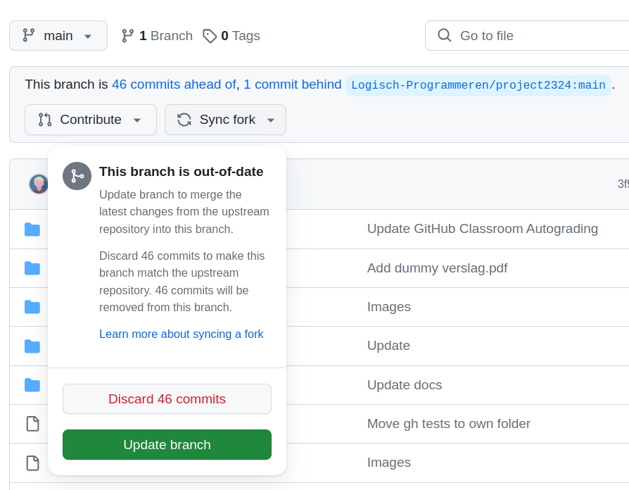

[](https://classroom.github.com/a/sgc-YJbM)
# Project 2023-2024

+ **[Opgave](./ASSIGNMENT.md)**
+ **[Example input](./tests/examples/)**
+ **[Test with random player](./tests/random/)**

## Using GitHub Classroom

### Updated Assignment

Whenever the assignment repo is updated, you will get a notification to sync your fork.
Do this as soon as possible, and always choose `update branch`, or your own commits will be lost.



> [!caution]
> Never choose discard, this will remove your own commits!

### Autograding

GitHub Classroom runs some initial test whenever you push a new commit, this feature is called *autograding*.
For this project the tests are found under the folder [tests/grading/](https://github.com/Logisch-Programmeren/project-tolauwae/tree/main/tests/grading). Under no circumstances should you change these files.

The autograding tests are there to help you, but do not represent the final evaluation of your project!
You should still write your own tests.

> [!important]
> Passing the autograding tests does not mean you passed this assignment.

### Avoiding Conflicts

GitHub Classroom can push commits to your main branch when autograding tests are updated:

```
➜ git push
To github.com:Logisch-Programmeren/project-tolauwae.git
 ! [rejected]        main -> main (fetch first)
error: failed to push some refs to 'github.com:Logisch-Programmeren/project-tolauwae.git'
hint: Updates were rejected because the remote contains work that you do
hint: not have locally. This is usually caused by another repository pushing
hint: to the same ref. You may want to first integrate the remote changes
hint: (e.g., 'git pull ...') before pushing again.
hint: See the 'Note about fast-forwards' in 'git push --help' for details.
```

The preferred method for fixing this is with:

```bash
git pull --rebase
```

